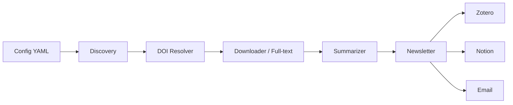

# Alberto Research

Scientific research automation, from discovery to digest, with contracts.

🇧🇷 [Português](README.md) | 🇺🇸 English

[](https://github.com/gabriel-affonso/alberto-research/actions/workflows/ci.yml)
[](https://codecov.io/gh/gabriel-affonso/alberto-research)
[](https://pypi.org/project/alberto-research/)
[](https://pypi.org/project/alberto-research/)
[](https://github.com/gabriel-affonso/alberto-research/blob/main/LICENSE)
[](https://github.com/astral-sh/ruff)
[](https://mypy-lang.org/)
[](https://securityscorecards.dev/viewer/?uri=github.com/gabriel-affonso/alberto-research)

## Table of contents

- [Motivation / Problem](#motivation--problem)
- [Demo](#demo)
- [Features](#features)
- [Architecture](#architecture)
- [Installation](#installation)
- [Quickstart](#quickstart)
- [Configuration](#configuration)
- [Advanced usage](#advanced-usage)
- [Integrations](#integrations)
- [Roadmap](#roadmap)
- [Contributing](#contributing)
- [Citation](#citation)
- [License](#license)
- [Legal notice](#legal-notice)
- [Acknowledgments](#acknowledgments)

## Motivation / Problem

The scientific literature grows faster than anyone can read it. New preprints, peer-reviewed articles and retractions appear every day, and a single active topic can produce hundreds of relevant results per month. Keeping up by hand has become a full-time job that nobody can sustain.

Manual triage does not scale either. Deciding what deserves a deep read means comparing title, abstract, venue, date and authors against a relevance criterion that shifts over time. Done by hand, the process is slow, inconsistent between sessions, and impossible to audit afterwards, because the decisions end up scattered across tabs, notes and memory.

And delegating that triage to an LLM without contracts is dangerous. Models hallucinate references, follow instructions hidden inside PDFs, and return free-form text that cannot be persisted safely. That is why Alberto Research treats all external content as hostile and only stores structured output after validating it against a JSON Schema. Deterministic work stays in Python; judgement stays behind explicit, auditable contracts.

## Demo


To reproduce the same flow locally, with no destructive network calls and no writes to the database:

```bash
alberto-research research run --project examples/basic.yaml --dry-run
```

`--dry-run` exercises the full pipeline end to end in simulation mode. The command above is reproducible from a clone of the repository, after installing the project and its development dependencies.

## Features

- 🔎 **Discovery** of literature through Crossref and Semantic Scholar from a single project YAML.
- 🧹 **Deduplication and DOI normalisation**, with filters for date range, language, inclusion and exclusion terms.
- 🧠 **LLM screening** executed through OpenClaw, with structured output validated by JSON Schema.
- 📄 **Full-text resolution** through a pluggable chain of legal open-access sources.
- 📚 **Deep reading** with extraction of arguments, evidence and limitations, also schema-validated.
- 🧩 **Synthesis and relationships** across papers, including contradiction detection and citation chasing.
- 📰 **Digest and newsletter** generated from the pipeline's own editorial selection.
- 🔗 **Optional integrations** with Zotero, Notion and email delivery over SMTP.
- 🗄️ **SQLite as the operational source of truth**, with versioned SQL migrations bundled in the package.
- 🛡️ **External content treated as hostile**, with download limits and mandatory LLM output validation.

## Architecture



The key package modules are `alberto_research.workflow` (pipeline orchestration), `alberto_research.config` (project YAML loading and validation), `alberto_research.fulltext` (full-text resolution and download), `alberto_research.providers` (Crossref, Semantic Scholar and other sources), `alberto_research.db` (SQLite, repositories and migrations) and `alberto_research.digest` (digest and newsletter assembly).

## Installation

With [pipx](https://pipx.pypa.io/), to isolate the CLI in a dedicated environment:

```bash
pipx install alberto-research
```

With [uv](https://docs.astral.sh/uv/), as a global tool:

```bash
uv tool install alberto-research
```

With pip, inside a virtual environment:

```bash
pip install alberto-research
```

Or with Docker, building the image from the repository's `Dockerfile`:

```bash
docker build -t alberto-research . && docker run --rm alberto-research --version
```

Requirements: Python 3.11, 3.12 or 3.13. After installation the CLI is available as `alberto-research`; the same entry point can also be invoked as `python -m alberto_research`. LLM work is delegated to OpenClaw, so an `openclaw` binary must be available on `PATH` (or pointed at by `ALBERTO_OPENCLAW_BIN`).

## Quickstart

```bash
# 1. Create the operational database and apply migrations
alberto-research db migrate --db alberto.db

# 2. Validate a project file before spending API calls
alberto-research config validate examples/basic.yaml

# 3. Sanity-check the pipeline with no side effects
alberto-research research run --project examples/basic.yaml --dry-run

# 4. Run the research for real
alberto-research research run --project examples/basic.yaml

# 5. Generate the digest
alberto-research research digest --project examples/basic.yaml
```

## Configuration

All credential-sensitive behaviour is read from the process environment. No credential is required just for the project to start: optional integrations stay off while their variables are empty. The commented template lives in `.env.example`.

| Variable | Required? | Description |
| --- | --- | --- |
| `ALBERTO_DB` | Yes, for real runs | Path to the SQLite database holding runs, papers, digests and feedback. Created with migrations if it does not exist. |
| `ALBERTO_HOME` | Yes, for real runs | Root directory for operational state: downloaded full text, rendered newsletters, logs and caches. |
| `ALBERTO_OPENCLAW_BIN` | No | Path to the OpenClaw binary. Defaults to `openclaw` on `PATH`. |
| `ALBERTO_USER_AGENT` | No | User-Agent sent to scholarly APIs. Recommended in production so Crossref and Semantic Scholar do not rate-limit you. |
| `ALBERTO_MAX_FULLTEXT_BYTES` | No | Byte limit for a single full-text download. Guards against pathological or hostile PDFs. |
| `ALBERTO_EMAIL_PROVIDER` | No | Transport used to send the newsletter. An empty value disables email delivery. |
| `ALBERTO_NOTION_ENABLED` | No | Enables or disables Notion delivery. Defaults to disabled. |
| `LOG_LEVEL` | No | Log verbosity: `DEBUG`, `INFO`, `WARNING`, `ERROR` or `CRITICAL`. Defaults to `INFO`. |
| `ZOTERO_API_KEY` | No | Zotero API private key. Treat it as a credential. |
| `ZOTERO_LIBRARY_TYPE` | No | Zotero library kind: `user` or `group`. Defaults to `user`. |
| `ZOTERO_LIBRARY_ID` | No | Numeric Zotero library ID. |
| `NOTION_API_KEY` | No | Notion internal integration token. The integration must be shared with the target. |
| `NOTION_DATABASE_ID` | No | ID of the Notion database that receives digest pages. |
| `NOTION_DATA_SOURCE_ID` | No | ID of the Notion data source backing that database. |
| `SMTP_HOST` | No | SMTP server hostname. |
| `SMTP_PORT` | No | SMTP port: 587 for STARTTLS, 465 for implicit TLS. |
| `SMTP_USERNAME` | No | SMTP authentication username, often the sender's full address. |
| `SMTP_PASSWORD` | No | SMTP password or app token. Prefer an app password. |
| `SMTP_FROM` | No | `From` header on outgoing newsletters. |
| `SMTP_TO` | No | Recipient (or comma-separated list) for the newsletter. |
| `SEMANTIC_SCHOLAR_API_KEY` | No | Semantic Scholar API key; raises the anonymous rate limit substantially. |

A minimal project YAML:

```yaml
id: my-review
name: My Review
research_question: How do modular agent systems delegate the reading of untrusted content?
priority_topics:
  - agent orchestration
languages:
  - en
date_ranges:
  start: 2020-01-01
  end: 2026-12-31
discovery_limits:
  crossref: 5
  semantic_scholar: 5
screening_threshold: 0.55
deep_reading_threshold: 0.8
maximum_daily_deep_reads: 3
fulltext:
  enable_scihub: false
  enable_annas_archive: false
  unpaywall_email: "research@example.com"
  resolver_order:
    - unpaywall
    - openalex
    - core
    - doaj
    - europepmc
notion:
  enabled: false
```

## Advanced usage

`examples/advanced.yaml` shows a configuration with everything turned on: deeper citation chasing, larger discovery limits, DOI-prefix exclusion filters and full delivery (digest, Notion and email). Use it as a reference when you want to understand how the options interact.

`examples/newsletter-only.yaml` does the opposite: a lean discovery-and-digest flow, with no deep reading and no external synchronisation. It is the recommended starting point if all you want is a periodic selection of papers.

Human feedback closes the loop and feeds back into screening:

```bash
alberto-research research feedback --project examples/basic.yaml --type VERY_IMPORTANT --paper-id 42 --note "Revisit methodology"
```

The accepted types are `VERY_IMPORTANT`, `USEFUL`, `IRRELEVANT`, `READ_PERSONALLY` and `INVESTIGATE_REFERENCES`.

## Integrations

- **Zotero**: library synchronisation configured through `ZOTERO_API_KEY`, `ZOTERO_LIBRARY_TYPE` and `ZOTERO_LIBRARY_ID`. It can also act as a full-text resolver when credentials are present.
- **Notion**: digest mirroring into a Notion database. Set `NOTION_API_KEY` and `NOTION_DATA_SOURCE_ID`, run `alberto-research notion setup --parent-page-id PAGE`, then `alberto-research notion backfill` to import history.
- **Email (SMTP)**: newsletter delivery via `ALBERTO_EMAIL_PROVIDER` and the `SMTP_*` variables. Disabled by default.
- **OpenClaw**: the orchestration runtime that executes the LLM tasks (screening, deep reading, synthesis). The binary is resolved from `ALBERTO_OPENCLAW_BIN`, defaulting to `openclaw` on `PATH`.

Zotero and Notion are optional integrations: the pipeline works end to end without them.

## Roadmap

The evolution plan, the milestones in progress and what is currently out of scope are in [ROADMAP.md](ROADMAP.md).

## Contributing

Contributions are welcome. Read [CONTRIBUTING.md](CONTRIBUTING.md) for the development workflow, the coding standards and how to run the tests. If you are just getting started, look for issues labelled `good first issue`: they are deliberately scoped and carry enough context for a first contribution.

## Citation

```bibtex
@software{alberto_research,
  title        = {Alberto Research},
  author       = {Affonso, Gabriel},
  year         = {2026},
  version      = {0.1.0},
  license      = {MIT},
  url          = {https://github.com/gabriel-affonso/alberto-research},
  note         = {Scientific research automation under OpenClaw}
}
```

The citation metadata is also available in [CITATION.cff](CITATION.cff), in Citation File Format.

## License

Distributed under the MIT license. The full text is in [LICENSE](LICENSE).

Copyright (c) 2025–2026 Gabriel Affonso.

## Legal notice

> **Read this before enabling any optional resolver.**
>
> By default, Alberto Research runs on **legal open-access sources only**. The resolvers used by the default configuration point at public and licensed services, and that is the supported mode of the project.
>
> There are, **optionally and disabled by default**, resolver chains targeting shadow libraries, including Sci-Hub, Library Genesis and Anna's Archive. Those resolvers:
>
> - are **disabled by default** and stay inactive unless explicitly switched on;
> - require installing the `legacy-resolvers` extra;
> - require the `enable_scihub: true` configuration option;
> - **disable TLS certificate verification** on the requests they make, which removes an important protection against interception;
> - are the **sole legal responsibility of whoever enables them**.
>
> The maintainers **do not condone and do not support** the use of those resolvers. Enabling them may violate copyright law, terms of service and institutional policy in your jurisdiction. Please do not open issues asking for support, block circumvention or legal guidance for that mode of operation.

### Ownership, absence of affiliation and scope of the software

> Alberto Research is an independent software project, authored by and belonging to **Gabriel Affonso**. It has **no link, sponsorship, partnership or affiliation whatsoever with Sci-Hub, Library Genesis, Anna's Archive or any other third-party service**, nor with their operators. The names mentioned belong to their respective owners and are used only to refer, descriptively, to which services an optional integration may contact.
>
> The project **does not host, distribute, store or intermediate** copyright-protected works, and keeps no collection of its own. It is a **software utility**: much like a web browser or a torrent client, it can be pointed at third-party services that the operator itself chooses to reach, and it **does not control, represent or answer for those services**, their content, or the way they are operated.
>
> The project's default path uses only legitimate open scholarly APIs. Any optional integration with third-party services stays **disabled by default** and is activated solely by an explicit decision of the operator, who bears, exclusively, all responsibility for the use made and for its legal consequences.
>
> This notice describes the project's scope and ownership; it is **not legal advice and carries no warranty of any kind**, and it does not replace an assessment of the laws applicable in your jurisdiction.

## Acknowledgments

This project stands on the work of other people and organisations. We thank [OpenClaw](https://github.com/openclaw) for the orchestration runtime behind the LLM steps; [Crossref](https://www.crossref.org/) for the metadata and DOI infrastructure; [Unpaywall](https://unpaywall.org/) for the open-access location index; [OpenAlex](https://openalex.org/) for the open scholarly knowledge graph; [CORE](https://core.ac.uk/) for the open repository aggregator; [DOAJ](https://doaj.org/) for the directory of open-access journals; [Europe PMC](https://europepmc.org/) for the life-sciences literature; and [Semantic Scholar](https://www.semanticscholar.org/) for discovery and enriched metadata.
