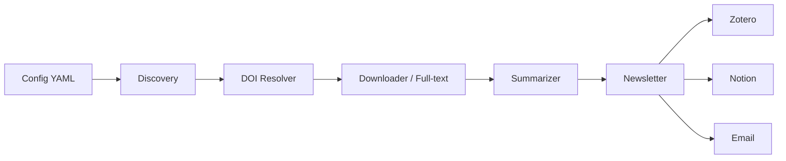

# Alberto Research

Automação de pesquisa científica, da descoberta ao digest, com contratos.

🇧🇷 Português | 🇺🇸 [English](README.en.md)

[](https://github.com/gabriel-affonso/alberto-research/actions/workflows/ci.yml)
[](https://codecov.io/gh/gabriel-affonso/alberto-research)
[](https://pypi.org/project/alberto-research/)
[](https://pypi.org/project/alberto-research/)
[](https://github.com/gabriel-affonso/alberto-research/blob/main/LICENSE)
[](https://github.com/astral-sh/ruff)
[](https://mypy-lang.org/)
[](https://securityscorecards.dev/viewer/?uri=github.com/gabriel-affonso/alberto-research)

## Índice

- [Motivação / Problema](#motivação--problema)
- [Demonstração](#demonstração)
- [Funcionalidades](#funcionalidades)
- [Arquitetura](#arquitetura)
- [Instalação](#instalação)
- [Quickstart](#quickstart)
- [Configuração](#configuração)
- [Uso avançado](#uso-avançado)
- [Integrações](#integrações)
- [Roadmap](#roadmap)
- [Contribuindo](#contribuindo)
- [Citação](#citação)
- [Licença](#licença)
- [Aviso legal](#aviso-legal)
- [Agradecimentos](#agradecimentos)

## Motivação / Problema

A literatura científica cresce mais rápido do que qualquer pessoa consegue ler. Todos os dias surgem novos preprints, artigos revisados por pares e retratações, e um único tópico ativo pode render centenas de resultados relevantes por mês. Acompanhar isso manualmente virou um trabalho de tempo integral que ninguém consegue sustentar.

A triagem manual também não escala. Decidir o que merece leitura profunda exige comparar título, resumo, veículo, data e autores contra um critério de relevância que muda com o tempo. Feito à mão, o processo é lento, inconsistente entre sessões e impossível de auditar depois, porque as decisões ficam espalhadas em abas, notas e memória.

E delegar essa triagem a um LLM sem contratos é perigoso. Modelos alucinam referências, aceitam instruções escondidas em PDFs e devolvem texto livre que não pode ser persistido com segurança. Por isso o Alberto Research trata todo conteúdo externo como hostil e só grava saída estruturada depois de validá-la contra um JSON Schema. O trabalho determinístico fica em Python; o julgamento fica atrás de contratos explícitos e auditáveis.

## Demonstração


Para reproduzir o mesmo fluxo localmente, sem chamadas de rede destrutivas e sem escrever no banco:

```bash
alberto-research research run --project examples/basic.yaml --dry-run
```

O `--dry-run` executa o pipeline completo de ponta a ponta em modo de simulação. O comando acima é reproduzível a partir de um clone do repositório, depois de instalar o projeto e as dependências de desenvolvimento.

## Funcionalidades

- 🔎 **Descoberta** de literatura via Crossref e Semantic Scholar a partir de um único YAML de projeto.
- 🧹 **Deduplicação e normalização de DOI**, com filtros por período, idioma, termos de inclusão e exclusão.
- 🧠 **Triagem por LLM** executada via OpenClaw, com saída estruturada validada por JSON Schema.
- 📄 **Resolução de texto completo** por uma cadeia plugável de fontes de acesso aberto legais.
- 📚 **Leitura profunda** com extração de argumentos, evidências e limitações, também validada por schema.
- 🧩 **Síntese e relações** entre artigos, incluindo detecção de contradições e citação em cadeia.
- 📰 **Digest e newsletter** gerados a partir da seleção editorial do próprio pipeline.
- 🔗 **Integrações opcionais** com Zotero, Notion e envio por e-mail via SMTP.
- 🗄️ **SQLite como fonte de verdade operacional**, com migrações SQL versionadas e embarcadas no pacote.
- 🛡️ **Conteúdo externo tratado como hostil**, com limites de download e validação obrigatória de saída de LLM.

## Arquitetura



Os módulos centrais do pacote são `alberto_research.workflow` (orquestração do pipeline), `alberto_research.config` (carregamento e validação do YAML de projeto), `alberto_research.fulltext` (resolução e download de texto completo), `alberto_research.providers` (Crossref, Semantic Scholar e demais fontes), `alberto_research.db` (SQLite, repositórios e migrações) e `alberto_research.digest` (montagem do digest e da newsletter).

## Instalação

Com [pipx](https://pipx.pypa.io/), para isolar a CLI em um ambiente dedicado:

```bash
pipx install alberto-research
```

Com [uv](https://docs.astral.sh/uv/), como ferramenta global:

```bash
uv tool install alberto-research
```

Com pip, dentro de um ambiente virtual:

```bash
pip install alberto-research
```

Ou via Docker, construindo a imagem a partir do `Dockerfile` do repositório:

```bash
docker build -t alberto-research . && docker run --rm alberto-research --version
```

Requisitos: Python 3.11, 3.12 ou 3.13. Depois de instalar, a CLI fica disponível como `alberto-research`; a mesma entrada também pode ser chamada como `python -m alberto_research`. O trabalho de LLM é delegado ao OpenClaw, então um binário `openclaw` precisa estar disponível no `PATH` (ou apontado por `ALBERTO_OPENCLAW_BIN`).

## Quickstart

```bash
# 1. Crie o banco operacional e aplique as migrações
alberto-research db migrate --db alberto.db

# 2. Valide um arquivo de projeto antes de gastar chamadas de API
alberto-research config validate examples/basic.yaml

# 3. Confira rapidamente o pipeline sem efeitos colaterais
alberto-research research run --project examples/basic.yaml --dry-run

# 4. Rode a pesquisa de verdade
alberto-research research run --project examples/basic.yaml

# 5. Gere o digest
alberto-research research digest --project examples/basic.yaml
```

## Configuração

Todo o comportamento sensível a credenciais é lido do ambiente do processo. Uma credencial nunca é obrigatória para o projeto sequer iniciar: integrações opcionais ficam desligadas enquanto suas variáveis estiverem vazias. O template comentado está em `.env.example`.

| Variável | Obrigatória? | Descrição |
| --- | --- | --- |
| `ALBERTO_DB` | Sim, para execuções reais | Caminho do banco SQLite com execuções, artigos, digests e feedback. Criado com migrações se não existir. |
| `ALBERTO_HOME` | Sim, para execuções reais | Diretório raiz do estado operacional: texto completo baixado, newsletters renderizadas, logs e caches. |
| `ALBERTO_OPENCLAW_BIN` | Não | Caminho do binário do OpenClaw. Padrão: `openclaw` no `PATH`. |
| `ALBERTO_USER_AGENT` | Não | User-Agent enviado às APIs acadêmicas. Recomendado em produção para não ser limitado por Crossref e Semantic Scholar. |
| `ALBERTO_MAX_FULLTEXT_BYTES` | Não | Limite em bytes para um único download de texto completo. Protege contra PDFs patológicos ou hostis. |
| `ALBERTO_EMAIL_PROVIDER` | Não | Transporte de envio da newsletter. Um valor vazio desliga a entrega por e-mail. |
| `ALBERTO_NOTION_ENABLED` | Não | Liga ou desliga a entrega no Notion. Padrão: desligado. |
| `LOG_LEVEL` | Não | Verbosidade de log: `DEBUG`, `INFO`, `WARNING`, `ERROR` ou `CRITICAL`. Padrão: `INFO`. |
| `ZOTERO_API_KEY` | Não | Chave privada da API do Zotero. Trate como credencial. |
| `ZOTERO_LIBRARY_TYPE` | Não | Tipo de biblioteca do Zotero: `user` ou `group`. Padrão: `user`. |
| `ZOTERO_LIBRARY_ID` | Não | ID numérico da biblioteca do Zotero. |
| `NOTION_API_KEY` | Não | Token de integração interna do Notion. A integração precisa ser compartilhada com o destino. |
| `NOTION_DATABASE_ID` | Não | ID do banco do Notion que recebe as páginas de digest. |
| `NOTION_DATA_SOURCE_ID` | Não | ID do data source do Notion por trás desse banco. |
| `SMTP_HOST` | Não | Hostname do servidor SMTP. |
| `SMTP_PORT` | Não | Porta SMTP: 587 para STARTTLS, 465 para TLS implícito. |
| `SMTP_USERNAME` | Não | Usuário de autenticação SMTP, normalmente o endereço completo do remetente. |
| `SMTP_PASSWORD` | Não | Senha ou token de app do SMTP. Prefira uma senha de aplicativo. |
| `SMTP_FROM` | Não | Cabeçalho `From` das newsletters enviadas. |
| `SMTP_TO` | Não | Destinatário (ou lista separada por vírgulas) da newsletter. |
| `SEMANTIC_SCHOLAR_API_KEY` | Não | Chave da API do Semantic Scholar; aumenta bastante o limite de requisições anônimas. |

Um projeto mínimo em YAML:

```yaml
id: minha-revisao
name: Minha Revisão
research_question: Como sistemas de agentes modulares delegam leitura de conteúdo não confiável?
priority_topics:
  - orquestração de agentes
languages:
  - en
date_ranges:
  start: 2020-01-01
  end: 2026-12-31
discovery_limits:
  crossref: 5
  semantic_scholar: 5
screening_threshold: 0.55
deep_reading_threshold: 0.8
maximum_daily_deep_reads: 3
fulltext:
  enable_scihub: false
  enable_annas_archive: false
  unpaywall_email: "research@example.com"
  resolver_order:
    - unpaywall
    - openalex
    - core
    - doaj
    - europepmc
notion:
  enabled: false
```

## Uso avançado

O arquivo `examples/advanced.yaml` mostra uma configuração com todos os recursos ligados: citação em cadeia em profundidade, limites maiores de descoberta, filtros de exclusão por prefixo de DOI e entrega completa (digest, Notion e e-mail). Use-o como referência quando quiser entender o efeito combinado das opções.

O arquivo `examples/newsletter-only.yaml` faz o oposto: um fluxo enxuto de descoberta e digest, sem leitura profunda e sem sincronização externa. É o ponto de partida indicado para quem só quer receber uma seleção periódica de artigos.

O feedback humano fecha o ciclo e realimenta a triagem:

```bash
alberto-research research feedback --project examples/basic.yaml --type VERY_IMPORTANT --paper-id 42 --note "Revisar metodologia"
```

Os tipos aceitos são `VERY_IMPORTANT`, `USEFUL`, `IRRELEVANT`, `READ_PERSONALLY` e `INVESTIGATE_REFERENCES`.

## Integrações

- **Zotero**: sincronização de biblioteca configurada por `ZOTERO_API_KEY`, `ZOTERO_LIBRARY_TYPE` e `ZOTERO_LIBRARY_ID`. Também pode atuar como resolvedor de texto completo quando as credenciais estão presentes.
- **Notion**: espelhamento do digest em um banco do Notion. Configure `NOTION_API_KEY` e `NOTION_DATA_SOURCE_ID`, rode `alberto-research notion setup --parent-page-id PAGE` e depois `alberto-research notion backfill` para importar o histórico.
- **E-mail (SMTP)**: entrega da newsletter com `ALBERTO_EMAIL_PROVIDER` e as variáveis `SMTP_*`. Desligada por padrão.
- **OpenClaw**: runtime de orquestração que executa as tarefas de LLM (triagem, leitura profunda, síntese). O binário é resolvido pelo `ALBERTO_OPENCLAW_BIN`, com padrão `openclaw` no `PATH`.

Zotero e Notion são integrações opcionais: o pipeline funciona por completo sem elas.

## Roadmap

O plano de evolução, os marcos em andamento e o que está fora de escopo por enquanto estão em [ROADMAP.md](ROADMAP.md).

## Contribuindo

Contribuições são bem-vindas. Leia [CONTRIBUTING.md](CONTRIBUTING.md) para entender o fluxo de desenvolvimento, os padrões de código e como rodar os testes. Se você está começando agora, procure as issues marcadas como `good first issue`: elas são delimitadas de propósito e têm contexto suficiente para uma primeira contribuição.

## Citação

```bibtex
@software{alberto_research,
  title        = {Alberto Research},
  author       = {Affonso, Gabriel},
  year         = {2025},
  version      = {0.1.0},
  license      = {MIT},
  url          = {https://github.com/gabriel-affonso/alberto-research},
  note         = {Automacao de pesquisa cientifica sob OpenClaw}
}
```

Os metadados de citação também estão em [CITATION.cff](CITATION.cff), no formato Citation File Format.

## Licença

Distribuído sob a licença MIT. O texto completo está em [LICENSE](LICENSE).

Copyright (c) 2025 Gabriel Affonso.

## Aviso legal

> **Leia antes de habilitar qualquer resolvedor opcional.**
>
> O Alberto Research opera, por padrão, **apenas com fontes legais de acesso aberto**. Os resolvedores usados na configuração padrão apontam para serviços públicos e licenciados, e é esse o modo suportado do projeto.
>
> Existem, de forma **opcional e desligada por padrão**, cadeias de resolução voltadas a bibliotecas sombra (*shadow libraries*), incluindo Sci-Hub, Library Genesis e Anna's Archive. Esses resolvedores:
>
> - são **desabilitados por padrão** e permanecem inativos a menos que sejam explicitamente ligados;
> - exigem a instalação do extra `legacy-resolvers`;
> - exigem a opção de configuração `enable_scihub: true`;
> - **desativam a verificação de certificado TLS** nas requisições que fazem, o que remove uma proteção importante contra interceptação;
> - são de **responsabilidade legal exclusiva de quem os habilita**.
>
> Os mantenedores **não endossam e não apoiam** o uso desses resolvedores. Habilitá-los pode violar leis de direitos autorais, termos de serviço e políticas institucionais na sua jurisdição. Não abra issues pedindo suporte, contorno de bloqueios ou orientação jurídica para esse modo de operação.

### Titularidade, ausência de afiliação e escopo do software

> O Alberto Research é um projeto de software independente, de autoria e titularidade de **Gabriel Affonso**. **Não possui qualquer vínculo, patrocínio, parceria ou afiliação com o Sci-Hub, Library Genesis, Anna's Archive ou com qualquer outro serviço de terceiros**, tampouco com seus operadores. Os nomes citados pertencem aos seus respectivos titulares e são usados apenas para descrever, de forma referencial, quais serviços podem ser consultados por uma integração opcional.
>
> O projeto **não hospeda, não distribui, não armazena e não intermedeia** obras protegidas por direitos autorais, nem mantém qualquer acervo próprio. É um **utilitário de software**: assim como um navegador ou um cliente de torrent, pode ser apontado para serviços de terceiros que o próprio operador escolhe acessar, e **não controla, não representa e não responde por esses serviços**, por seu conteúdo ou pela forma como são operados.
>
> O caminho padrão do projeto usa apenas APIs acadêmicas abertas e legítimas. Qualquer integração opcional com serviços de terceiros permanece **desativada por padrão** e só se ativa por decisão explícita do operador, que assume, com exclusividade, toda a responsabilidade pelo uso que fizer e pelas consequências legais dele.
>
> Este aviso descreve o escopo e a titularidade do projeto; **não constitui aconselhamento jurídico nem garantia de qualquer espécie**, e não substitui a análise das leis aplicáveis na sua jurisdição.

## Agradecimentos

Este projeto existe sobre o trabalho de outras pessoas e organizações. Agradecemos ao [OpenClaw](https://github.com/openclaw), pelo runtime de orquestração que sustenta as etapas de LLM; ao [Crossref](https://www.crossref.org/), pela infraestrutura de metadados e DOIs; ao [Unpaywall](https://unpaywall.org/), pelo índice de localização de acesso aberto; ao [OpenAlex](https://openalex.org/), pelo grafo aberto de conhecimento acadêmico; ao [CORE](https://core.ac.uk/), pelo agregador de repositórios abertos; ao [DOAJ](https://doaj.org/), pelo diretório de periódicos de acesso aberto; ao [Europe PMC](https://europepmc.org/), pela literatura em ciências da vida; e ao [Semantic Scholar](https://www.semanticscholar.org/), pela descoberta e pelos metadados enriquecidos.
