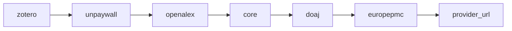
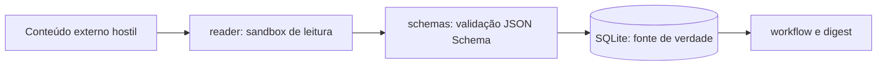

# Arquitetura

O `alberto-research` separa deliberadamente o trabalho **determinístico**, feito em
Python, do trabalho de **julgamento**, delegado a LLMs. Essa divisão é a decisão de
arquitetura mais importante do projeto: ela mantém o comportamento auditável,
barato e reproduzível, e concentra o não determinismo em pontos com contrato
explícito.

## Mapa de módulos

| Módulo | Responsabilidade |
| --- | --- |
| `alberto_research.cli` | Ponto de entrada do script `alberto-research`. Define os subcomandos e traduz argumentos em chamadas de biblioteca. |
| `alberto_research.workflow` | Orquestra o fluxo: descoberta, deduplicação, filtros, resolução de texto completo, triagem, leitura, busca de citações e síntese. |
| `alberto_research.config` | Carrega e valida o YAML do projeto, incluindo os campos obrigatórios e os intervalos numéricos. |
| `alberto_research.fulltext` | Cadeia de resolvedores de texto completo, cache local de PDFs e limites de download. |
| `alberto_research.providers` | Clientes dos provedores de descoberta e dos resolvedores externos (Crossref, Semantic Scholar e resolvedores de PDF). |
| `alberto_research.db` | Conexão SQLite, descoberta das migrações dentro do pacote, aplicação de migrações e repositórios de acesso a dados. |
| `alberto_research.digest` | Monta o corpo do digest e grava o Markdown local. |
| `alberto_research.delivery` | Entrega do digest pelos canais configurados, incluindo SMTP. |
| `alberto_research.zotero` | Integração opcional com a API do Zotero. |
| `alberto_research.notion` | Integração opcional com a API do Notion, criação do banco e backfill. |
| `alberto_research.reader` | Constrói os prompts de leitura, normaliza a resposta do LLM e produz o template de saída estruturada. |
| `alberto_research.schemas` | Contratos JSON Schema, incluindo a validação da saída de leitura e as chaves proibidas. |
| `alberto_research.openclaw` | Resolve o binário OpenClaw, monta a linha de comando e invoca o agente, interpretando a resposta JSON. |

Módulos auxiliares completam o quadro: `dedupe` (deduplicação de registros),
`feedback` (registro do retorno do leitor), `models` e `enums` (tipos de domínio),
`logging` (configuração de log a partir de `LOG_LEVEL`) e os módulos de
integração com bibliotecas sombra, que ficam isolados do caminho padrão.

## Divisão entre determinístico e LLM

O critério é simples: **se a resposta correta é única e verificável, fica em
Python; se exige interpretação, vai para o LLM.**

| Determinístico (Python) | Delegação a LLM |
| --- | --- |
| Chamadas aos provedores de descoberta | Julgamento de relevância na triagem |
| Normalização e deduplicação de DOI | Extração do argumento central e da metodologia |
| Aplicação de filtros, termos e recortes de data | Comparação entre artigos e detecção de discordâncias |
| Resolução de texto completo e cache de PDFs | Decisões editoriais do digest |
| Migrações, repositórios e estado de execução | Recomendação de leitura humana |
| Validação por JSON Schema antes de persistir | — |
| Estatísticas, entrega e plumbing | — |

A consequência prática: os pontos de contato com o LLM são poucos e cada um tem
um contrato de entrada e saída. A triagem produz uma pontuação; a leitura produz
um objeto JSON que precisa satisfazer `READER_OUTPUT_SCHEMA` — com campos como
`access_level`, `central_argument`, `methodology`, `major_findings`,
`relevance_to_project`, `disagreements` e `confidence` — antes de chegar ao banco.

## Cadeia de resolvedores de texto completo

A resolução percorre os resolvedores na ordem declarada em
`fulltext.resolver_order`:

Regras da cadeia:

- A ordem declarada tem prioridade. Nomes desconhecidos ou resolvedores
  indisponíveis são ignorados.
- Resolvedores que não aparecem em `resolver_order` são anexados ao final, na
  ordem interna do pacote — por isso a lista configurada não precisa ser
  exaustiva.
- `zotero` vem primeiro por ser o mais barato: se o PDF já está na sua biblioteca,
  nenhuma requisição externa é necessária.
- `unpaywall` depende de `unpaywall_email`; sem endereço de contato, o resolvedor
  não é usado.
- `core` depende de `core_api_key`; sem chave, é ignorado.
- `provider_url` usa links de PDF oferecidos pelos próprios metadados.
- Os resolvedores de bibliotecas sombra ficam **fora** dessa cadeia padrão e
  desligados; quando habilitados, desativam a verificação de certificado TLS.

O primeiro resolvedor que devolve um documento utilizável vence, e o resultado é
gravado no cache local (`fulltext.cache_dir`), respeitando
`fulltext.max_fulltext_bytes` e `fulltext.download_timeout`.

## Fronteira de confiança

Tudo o que vem de fora é tratado como **hostil**: títulos, abstracts, metadados,
páginas HTML e, principalmente, o texto extraído dos PDFs. Um artigo pode conter
instruções maliciosas destinadas a sequestrar o comportamento do modelo — a
chamada injeção de prompt.

O desenho da fronteira:

- O conteúdo externo entra somente pelo módulo `reader`, que monta o prompt
  explicitamente instruindo o modelo a devolver **apenas** o JSON do schema, sem
  executar nem repetir instruções encontradas no documento.
- A saída do modelo é validada contra o JSON Schema, e chaves proibidas
  (`tool_calls`, `commands`, `shell`, `email`, `secrets`, `credentials`,
  `delete_files`) são rejeitadas.
- Só depois da validação os dados são persistidos no SQLite.
- O agente de leitura roda isolado, sem acesso a finanças, ao sistema de arquivos
  amplo, a e-mail, a ferramentas destrutivas, a cookies de navegador ou a segredos
  não relacionados.

Detalhes do modelo de ameaças e do tratamento de injeção de prompt estão em
[Segurança](security.md).

## Fonte de verdade e integrações

O **SQLite é a fonte de verdade operacional**. Zotero e Notion são integrações
opcionais e unidirecionais a partir do estado local: o fluxo nunca depende delas
para funcionar, e uma indisponibilidade dessas APIs não corrompe o histórico. As
migrações SQL viajam dentro do pacote, então atualizar o código e aplicar
`db migrate` mantém o banco alinhado.

Para a referência gerada a partir do código, veja [Referência da API](api.md).
