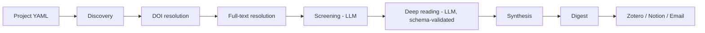

# Alberto Research

O `alberto-research` é uma ferramenta de linha de comando e biblioteca Python para
**automatizar uma rotina de pesquisa científica**: ele descobre artigos novos,
resolve identificadores, tenta obter o texto completo em fontes de acesso aberto,
triagem por relevância, lê os trabalhos mais promissores e sintetiza tudo em um
resumo diário entregue por e-mail, Zotero ou Notion.

O projeto foi feito para pesquisadores que acompanham um tema ao longo de meses e
não conseguem ler manualmente tudo o que é publicado. Ele mantém o trabalho
determinístico em Python — chamadas a provedores, normalização de DOI,
deduplicação, migrações, validação e entrega — e delega aos LLMs apenas o que
exige julgamento: relevância, extração de argumentos, comparação e síntese.

## O problema

Acompanhar literatura científica hoje envolve um fluxo manual e repetitivo:

- Novos artigos aparecem em muitos lugares (Crossref, Semantic Scholar, DOAJ,
  Europe PMC) e é preciso consultar cada um separadamente.
- PDFs de acesso aberto estão espalhados entre repositórios, Unpaywall, OpenAlex
  e CORE, cada um com um formato de resposta diferente.
- A maior parte dos resultados é irrelevante, e a triagem consome o tempo que
  deveria ser gasto na leitura.
- A leitura profunda não escala: ninguém consegue ler dezenas de artigos por dia.
- O histórico do que já foi lido e descartado se perde entre anotações soltas.
- Artigos baixados são conteúdo externo não confiável e não deveriam ser
  processados por um agente com acesso amplo ao sistema.

## O que ele faz

1. **Descoberta** — consulta provedores configurados usando a pergunta de pesquisa
   e os tópicos prioritários do projeto.
2. **Resolução de DOI** — normaliza identificadores e deduplica registros que
   descrevem o mesmo trabalho.
3. **Resolução de texto completo** — percorre uma cadeia de resolvedores legais e
   de acesso aberto até encontrar um PDF utilizável.
4. **Triagem (LLM)** — pontua cada candidato contra a pergunta de pesquisa e
   descarta o que fica abaixo de `screening_threshold`.
5. **Leitura profunda (LLM, validada por schema)** — extrai argumento central,
   metodologia, achados, conceitos e discordâncias em JSON estruturado.
6. **Síntese** — compara leituras, detecta contradições e monta o corpo do digest.
7. **Digest** — gera o resumo do dia, salva em disco e entrega pelos canais
   configurados.
8. **Feedback** — registra sua avaliação de cada item para ajustar execuções
   futuras.

## Arquitetura em uma imagem

Cada caixa corresponde a uma etapa do fluxo executado por
`alberto-research research run` e `alberto-research research digest`. O estado
operacional vive em um banco SQLite local, que é a fonte de verdade; Zotero e
Notion são integrações opcionais.

## Recursos

- **Configuração por projeto em YAML** — um arquivo descreve pergunta de pesquisa,
  tópicos, idiomas, limites e limiares; vários projetos convivem no mesmo banco.
- **Descoberta multiprovedor** — Crossref e Semantic Scholar com limites
  configuráveis por provedor.
- **Filtros de pesquisa** — apenas artigos, pular o que já foi lido, prefixos de
  DOI excluídos, termos de inclusão e exclusão.
- **Cadeia de resolvedores de texto completo** — Zotero, Unpaywall, OpenAlex,
  CORE, DOAJ, Europe PMC e URL do provedor, em ordem configurável.
- **Cache local de PDFs** — evita downloads repetidos e respeita um limite máximo
  de bytes por arquivo.
- **Triagem e leitura por LLM com contratos explícitos** — a saída de leitura é
  validada por JSON Schema antes de ser persistida.
- **Busca de citações (*citation chasing*)** — segue referências dos artigos já
  lidos até uma profundidade configurável.
- **Digest diário** — limite de itens, horário de entrega e salvamento local.
- **Entrega multicanal** — e-mail SMTP, arquivamento opcional no Zotero e no
  Notion.
- **Feedback do leitor** — cinco tipos de retorno para refinar a seleção.
- **Uso offline do banco** — as migrações SQL viajam dentro do pacote e as
  operações locais não dependem de rede.
- **Somente acesso aberto por padrão** — os resolvedores de bibliotecas sombra
  ficam desligados e exigem ação explícita do operador.

## Aviso legal

O caminho padrão e documentado é **exclusivamente de acesso aberto**. Os
resolvedores opcionais de bibliotecas sombra (Sci-Hub, Library Genesis e Anna's
Archive) são **desligados por padrão**, exigem a instalação do extra
`legacy-resolvers` e a ativação explícita de `enable_scihub: true`, desativam a
verificação de certificado TLS e são de **responsabilidade legal exclusiva do
operador**. Leia [Segurança](security.md) antes de considerar essa opção.

## Próximos passos

- [Instalação](installation.md) — instale com `pipx`, `uv` ou `pip`.
- [Configuração](configuration.md) — escreva o YAML do seu primeiro projeto.
- [Uso](usage.md) — rode o fluxo completo com `examples/basic.yaml`.
