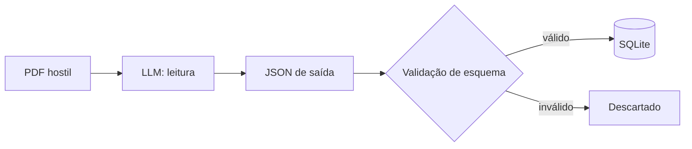

# Segurança

O `alberto-research` processa conteúdo que você não controla: metadados de
terceiros, páginas HTML e PDFs de origens diversas. Esta página descreve o modelo
de ameaças, como o sistema se protege e o que continua sendo responsabilidade sua.

## Modelo de ameaças

A premissa central é que **todo documento externo é hostil**. Um artigo, um
abstract ou um PDF pode ter sido escrito para manipular o comportamento do
modelo, e não para informar você.

| Ativo | Ameaça | Mitigação |
| --- | --- | --- |
| Banco SQLite (fonte de verdade) | Escrita de dados arbitrários vindos do LLM | Validação por JSON Schema antes de qualquer persistência; chaves proibidas rejeitadas. |
| Agente de leitura | Sequestro por injeção de prompt no texto do PDF | Prompt com contrato fechado, agente isolado e sem ferramentas perigosas. |
| Credenciais | Vazamento por logs, YAML versionado ou prompt | Segredos apenas em variáveis de ambiente; nunca no YAML do projeto nem no digest. |
| Sistema de arquivos | Escrita ou remoção fora do esperado | O agente de leitura não recebe ferramentas destrutivas nem acesso amplo ao disco. |
| Rede | Interceptação de tráfego | Verificação de TLS ativa por padrão em todo o caminho documentado. |
| Reputação legal | Uso de fontes não autorizadas | Resolvedores de bibliotecas sombra desligados por padrão. |

## Injeção de prompt

A injeção de prompt acontece quando um trecho de texto externo tenta se passar por
instrução do sistema — por exemplo, um PDF que pede ao modelo para ignorar as
regras anteriores, chamar uma ferramenta ou revelar um segredo.

O tratamento segue três camadas:

1. **Contrato de prompt fechado.** O módulo de leitura monta o prompt instruindo o
   modelo a devolver **apenas** o JSON do schema e a nunca executar nem repetir
   instruções encontradas no documento. O texto do artigo é dado, não comando.
2. **Estrutura obrigatória.** A resposta precisa ser um objeto JSON com campos
   definidos (`access_level`, `central_argument`, `methodology`,
   `major_findings`, `disagreements`, `confidence`, entre outros). Texto livre
   fora do schema não é aceito.
3. **Chaves proibidas.** Campos que pediriam ação — `tool_calls`, `commands`,
   `shell`, `email`, `secrets`, `credentials`, `delete_files` — são rejeitados
   explicitamente, mesmo que apareçam em uma resposta estruturalmente válida.

Nenhuma dessas camadas substitui a revisão humana. Considere qualquer instrução
encontrada no corpo de um artigo como parte do conteúdo hostil, e nunca configure
o agente de leitura com ferramentas que ele não deveria precisar.

## Validação antes da persistência

A regra é absoluta: **a saída estruturada do LLM só é gravada depois de passar pela
validação de esquema**. O fluxo é:

Isso protege o banco de dois modos: impede que dados com forma inesperada entrem, e
impede que uma resposta sequestrada contamine o histórico que alimenta os digests
seguintes. A validação garante **forma**, não veracidade — um objeto
perfeitamente válido ainda pode conter uma conclusão errada.

## Tratamento de segredos

- **Segredos ficam em variáveis de ambiente**, nunca no YAML do projeto.
  `NOTION_API_KEY`, `ZOTERO_API_KEY`, `SMTP_PASSWORD`, `SEMANTIC_SCHOLAR_API_KEY`
  e afins são lidos do ambiente.
- **Não versione** o banco, o cache de PDFs, os digests ou arquivos `.env` com
  credenciais.
- **Prefira endereços de função** a dados pessoais na configuração. O
  `unpaywall_email` é enviado a terceiros; use algo como `research@example.com`.
- **Rotacione** uma chave imediatamente se ela aparecer em log, issue ou
  histórico do Git.
- **Em containers**, passe segredos no runtime, não no `Dockerfile`.
- **Restrinja escopos**: use chaves de API com o mínimo de permissões necessárias.

## O risco das bibliotecas sombra

Esta é a parte da documentação que exige mais franqueza.

O pacote traz, de forma **opcional e desligada**, resolvedores que buscam artigos
em bibliotecas sombra — Sci-Hub, Library Genesis e Anna's Archive. Sobre eles:

- São **DESLIGADOS por padrão**. Uma instalação limpa nunca os aciona.
- Exigem a instalação do extra `legacy-resolvers` **e** a ativação explícita de
  `enable_scihub: true` no projeto (ou `enable_annas_archive: true`, para o
  resolvedor correspondente). Sem as duas coisas, não são usados.
- **Desativam a verificação de certificado TLS** para funcionar, o que remove uma
  proteção contra interceptação e adulteração do tráfego.
- São, em muitas jurisdições, de legalidade duvidosa ou ilícitos, e seu uso pode
  violar termos de serviço, direitos autorais e leis locais.
- A **responsabilidade legal pelo uso é exclusivamente do operador**. Os autores e
  mantenedores do `alberto-research` não endossam, não incentivam e não assumem
  qualquer responsabilidade pelo uso desses resolvedores.

**O caminho padrão e documentado é apenas acesso aberto legal.** Se você não tem
certeza absoluta sobre a legalidade no seu contexto, não instale o extra e não
ative essas opções. A cadeia legal — Zotero, Unpaywall, OpenAlex, CORE, DOAJ,
Europe PMC e URL do provedor — cobre uma fração grande e crescente da literatura.

## Isolamento do agente de leitura

O agente `research-reader` é o único ponto do sistema que lê texto de PDF em
profundidade, e é exatamente por isso que ele deve ser o mais restrito:

- **não** deve receber dados financeiros;
- **não** deve ter acesso amplo ao sistema de arquivos;
- **não** deve ter permissão de e-mail;
- **não** deve ter ferramentas destrutivas;
- **não** deve receber cookies de navegador;
- **não** deve receber segredos não relacionados à tarefa.

O agente de triagem, por sua vez, trabalha com metadados e abstracts — também
hostis, mas com superfície menor. Mantenha os dois separados.

## Como relatar uma vulnerabilidade

A política de segurança completa está no arquivo `SECURITY.md` do repositório. O
resumo operacional:

**Versões suportadas:** apenas a série `0.1.x` mais recente recebe correções de
segurança. Versões anteriores a `0.1.0` e snapshots de desenvolvimento não são
suportados.

**Canal:** use o relatório privado de vulnerabilidades do GitHub em
`https://github.com/gabriel-affonso/alberto-research/security/advisories/new`.
Esse é o canal preferido porque mantém o relato confidencial e permite
coordenação. **Não** abra uma issue pública para um problema de segurança.

**O que incluir em um relato útil:**

- a versão ou o commit afetado (`alberto-research --version`);
- uma reprodução mínima ou prova de conceito;
- o impacto que você acredita que o problema tem;
- qualquer correção sugerida;
- se você pretende divulgar publicamente, e em qual prazo.

Não inclua credenciais reais, dados pessoais ou material protegido por direitos
autorais de terceiros; redija o necessário.

**Prazos de resposta** (melhor esforço de uma equipe pequena):

| Etapa | Meta |
| --- | --- |
| Confirmação de recebimento | em até 72 horas |
| Triagem e avaliação de severidade | em até 7 dias |
| Plano de correção ou mitigação | em até 30 dias |

Se a correção depender de trabalho upstream coordenado, isso será informado e o
plano de mitigação será compartilhado no marco de 30 dias, em vez de o prazo
passar em silêncio.

## Se você suspeita de comprometimento

- Pare as execuções agendadas para interromper novas gravações.
- Preserve o banco e os logs para análise; não os sobrescreva.
- Rotacione todas as chaves que o processo tinha acesso: `NOTION_API_KEY`,
  `ZOTERO_API_KEY`, `SEMANTIC_SCHOLAR_API_KEY`, `SMTP_PASSWORD` e quaisquer
  outras do ambiente.
- Revise os digests e as leituras geradas no período para identificar conteúdo
  anômalo.
- Reinstale o pacote a partir de uma fonte confiável e reconstrua o ambiente a
  partir dos lockfiles com hashes — veja [Reprodutibilidade](reproducibility.md).
