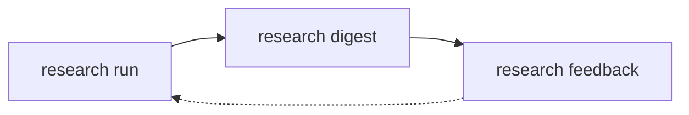

# Uso

Este guia percorre a rotina completa usando o projeto de exemplo
`examples/basic.yaml`, que acompanha o repositório. Todos os comandos abaixo
podem ser copiados e colados.

## Visão geral do ciclo

O trabalho se organiza em três comandos que formam um ciclo:

1. **`research run`** — descobre, resolve DOI, tenta obter texto completo, faz a
   triagem e a leitura profunda. Grava tudo no banco SQLite.
2. **`research digest`** — lê o resultado da execução e monta o resumo diário,
   salvando um Markdown e entregando pelos canais configurados.
3. **`research feedback`** — registra sua avaliação de cada item do digest. Esse
   retorno fica no banco e informa as próximas execuções.



## Passo 0 — preparar o banco

As migrações SQL viajam dentro do pacote e criam o esquema no banco local. Rode
uma vez antes do primeiro fluxo:

```bash
alberto-research db migrate
```

Saída esperada: nenhuma mensagem de erro e o banco criado em
`$ALBERTO_HOME/alberto.sqlite3`. Para usar um banco alternativo, passe `--db`:

```bash
alberto-research db migrate --db ./alberto-dev.sqlite3
```

## Passo 1 — validar o projeto

```bash
alberto-research config validate examples/basic.yaml
```

Esse comando não faz chamadas de rede. Ele confere campos obrigatórios, tipos e
intervalos. Corrija qualquer erro antes de continuar — veja
[Configuração](configuration.md).

## Passo 2 — ensaiar a execução

O modo `--dry-run` executa descoberta, normalização de DOI e deduplicação, mas
**não** grava os resultados nem gasta chamadas de LLM:

```bash
alberto-research research run --project examples/basic.yaml --dry-run
```

Use-o para confirmar que os provedores respondem, que a pergunta de pesquisa
retorna candidatos plausíveis e que os limites de descoberta estão calibrados. Se
a lista vier vazia ou muito ruidosa, ajuste `priority_topics`,
`inclusion_terms`, `exclusion_terms` e `discovery_limits` antes de gastar
orçamento de LLM.

## Passo 3 — executar o fluxo real

```bash
alberto-research research run --project examples/basic.yaml
```

O que acontece, em ordem:

1. Descoberta no Crossref e no Semantic Scholar, respeitando `discovery_limits`.
2. Normalização e deduplicação dos registros por DOI e metadados.
3. Aplicação de `research_filters` e do recorte de `date_ranges`.
4. Resolução de texto completo pela cadeia de `resolver_order`.
5. Triagem por LLM contra `research_question`; candidatos abaixo de
   `screening_threshold` são descartados.
6. Leitura profunda dos melhores candidatos, limitada por
   `maximum_daily_deep_reads` e por `deep_reading_threshold`. A saída do LLM é
   validada por JSON Schema antes de ser persistida.
7. Busca de citações, se `citation_chasing.enabled` for `true`.

Para apontar para outro banco:

```bash
alberto-research research run --project examples/basic.yaml --db ./alberto-dev.sqlite3
```

!!! tip "Custo"
    A triagem roda sobre todos os candidatos que passam dos filtros, e a leitura
    profunda só roda sobre os aprovados. Reduzir `discovery_limits` e subir
    `screening_threshold` é a forma mais direta de diminuir o custo por execução.
    Veja [Perguntas frequentes](faq.md).

## Passo 4 — gerar o digest

```bash
alberto-research research digest --project examples/basic.yaml
```

Como `digest.save_local` é `true` em `examples/basic.yaml`, o comando grava um
arquivo Markdown no diretório de saída. Para escolher outro diretório:

```bash
alberto-research research digest --project examples/basic.yaml --output-dir ./digests
```

Cada digest é salvo como `<project-id>-digest-<digest-id>.md`, por exemplo
`alberto-research-example-digest-12.md`. O `digest-id` é o registro criado no
banco, o que permite referenciar itens individualmente no passo seguinte.

Se `digest.enabled` for `false`, o comando não produz saída. Veja
[Solução de problemas](troubleshooting.md) se o digest vier vazio.

## Passo 5 — registrar feedback

Depois de ler o digest, registre sua avaliação. Existem cinco tipos:

| Tipo | Significado |
| --- | --- |
| `VERY_IMPORTANT` | Vale leitura imediata e deve pesar mais nas próximas seleções. |
| `USEFUL` | Relevante, mas não urgente. |
| `IRRELEVANT` | Ruído; sinaliza que a triagem errou. |
| `READ_PERSONALLY` | Você mesmo vai ler; não precisa de nova síntese. |
| `INVESTIGATE_REFERENCES` | As referências do artigo merecem ser seguidas. |

Você pode reagir a um item específico do digest:

```bash
alberto-research research feedback \
  --project examples/basic.yaml \
  --type VERY_IMPORTANT \
  --digest-item-id 42 \
  --note "Metodologia diretamente aplicável ao capítulo 3."
```

Ou diretamente a um artigo, mesmo fora do digest:

```bash
alberto-research research feedback \
  --project examples/basic.yaml \
  --type INVESTIGATE_REFERENCES \
  --paper-id 128
```

`--digest-item-id` e `--paper-id` identificam o alvo; `--note` é opcional e
guarda o motivo em texto livre. Use `--db` se estiver trabalhando com um banco
alternativo.

## Passo 6 — arquivar (opcional)

Se você usa Zotero ou Notion, configure as credenciais e então:

```bash
alberto-research notion setup --parent-page-id 00000000000000000000000000000000
```

Isso cria o banco de arquivamento no Notion. Depois, para enviar o que já está no
SQLite:

```bash
alberto-research notion backfill --project-id alberto-research-example
```

Sem `--project-id`, o backfill considera todos os projetos. Detalhes em
[Integrações](integrations.md).

## Automatizando com cron

Um par de entradas de cron cobre a rotina diária:

```cron
# Executa a descoberta e a leitura de manhã cedo.
0 6 * * * /usr/local/bin/alberto-research research run --project /etc/alberto/basic.yaml

# Gera e entrega o digest no horário configurado.
0 8 * * * /usr/local/bin/alberto-research research digest --project /etc/alberto/basic.yaml
```

O horário de `digest.delivery_time` é interpretado no `timezone` do projeto, então
mantenha o cron e o YAML coerentes.

## Resumo dos comandos

| Comando | Para que serve |
| --- | --- |
| `alberto-research --version` | Mostra a versão instalada. |
| `alberto-research db migrate [--db PATH]` | Aplica as migrações SQLite pendentes. |
| `alberto-research config validate PROJECT` | Valida o YAML de um projeto. |
| `alberto-research research run --project P [--db PATH] [--dry-run]` | Executa descoberta, resolução, triagem e leitura. |
| `alberto-research research digest --project P [--db PATH] [--output-dir DIR]` | Gera e entrega o digest. |
| `alberto-research research feedback --project P --type T [--db PATH] [--digest-item-id ID] [--paper-id INT] [--note TEXT]` | Registra feedback. |
| `alberto-research notion setup --parent-page-id PAGE [--title T]` | Cria o banco de arquivamento no Notion. |
| `alberto-research notion backfill [--db PATH] [--project-id ID]` | Envia leituras existentes para o Notion. |
